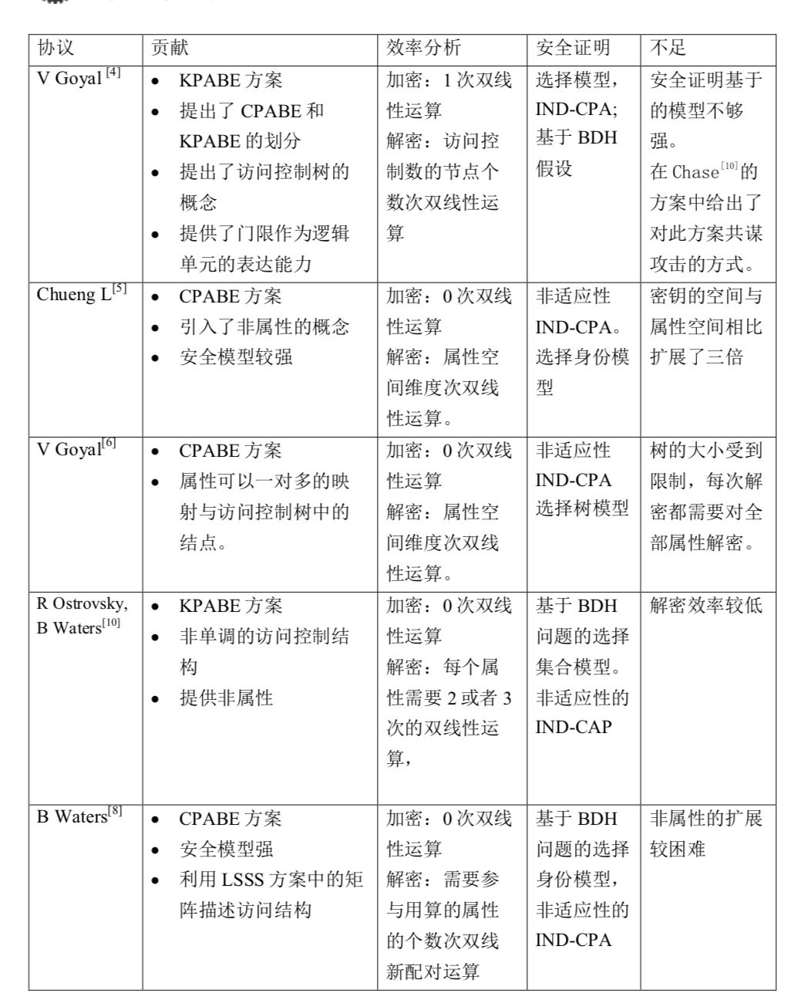

# here_to_start
From here to start our work

*	This is a table from [survey](abe/基于属性的加密算法.pdf) for development of abe from none(2005) to 2011

* [This](abe/Fuzzy_Identity-Based_Encryption.pdf) denotes the birth of abe

* [This](abe/Ciphertext-Policy_Attribute-Based_Encryption.pdf) denotes a millstone of abe

According to day 4/4's discussion, we should research abe-signcryption, thus [a](abe/Pandit2014_Chapter_Attribute-BasedSigncryptionSig.pdf) and [b](abe/Threshold_Attribute-Based_Signcryption_in_Standard_Model.pdf) are recommended.
